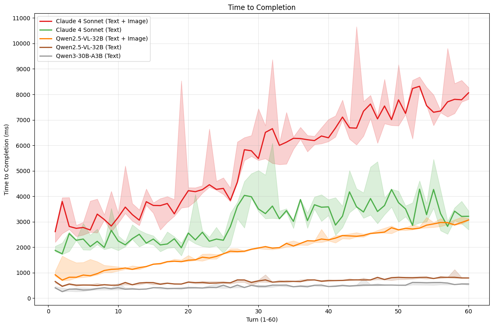

# VLM Inference Latency (Tiny) Benchmark

A small test for vision language model (VLM) inference speed on text+image to text generation.

Here I compare the response speed of Qwen 2.5 VL (except 72B) vs Claude 4 Sonnet. I ran on randomized conversation of 60 turns, where each turn contains one 720p image and one short text question.



## Experiment Commands

Here's how to use this repo.

**Setup**: I used 2xH100 80GB SXM5 GPU for Qwen models. I also had port 443 exposed for public traffic.

To test Qwen models e.g. `Qwen/Qwen2.5-VL-7B-Instruct`, start vLLM server on remote GPU node:

```bash
# NOTE: run on GPU node!
make pull 
make run MODEL=Qwen/Qwen2.5-VL-7B-Instruct TENSOR_PARALLEL=2 PORT=443 
make logs
```

Then run this script locally to start sending requests and logging time:

```bash
python scripts/s1_local_multi_modal.py \
    --model_name Qwen/Qwen2.5-VL-7B-Instruct \
    --data_seed 1337 \
    --output_file results/results.csv
```

To benchmark Claude 4 Sonnet, get a Anthropic API key and put it in a `.env` file on root level of this repo, then run the following script:

```bash
# this can be run locally.
python scripts/s2_remote_multi_modal.py \
    --model_name claude-sonnet-4-20250514 \
    --data_seed 1337 \
    --output_file results/results.csv
```